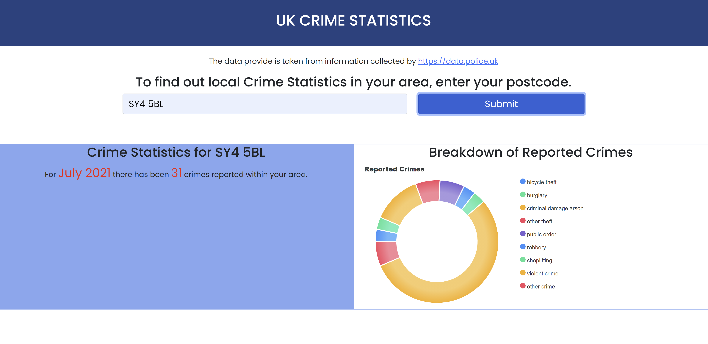

# UK Crime Statistics

Welcome,

This app was created using the data.police.uk api to display the latest crime statistics for the postcode a user enters. The stats are displayed for the month and the reported crimes are brokendown in a donught pie chart by category. 

## Languages & Frameworks
- HTML
- CSS
- JavaScript 
- Bootstrap
- Apex Charts

## Credit 

**Data**

The data was sourced from [Police API](http://data.police.uk/docs/) based on crimes reported by the UK police. The Api operates using a 'leaky bucket' algorithm as a controller. This allows for infrequent bursts of calls, and allows you to continue to make an unlimited amount of calls over time.

The current rate limit is 15 requests per second with a burst of 30. So, on average you must make fewer than 15 requests each second, but you can make up to 30 in a single second.